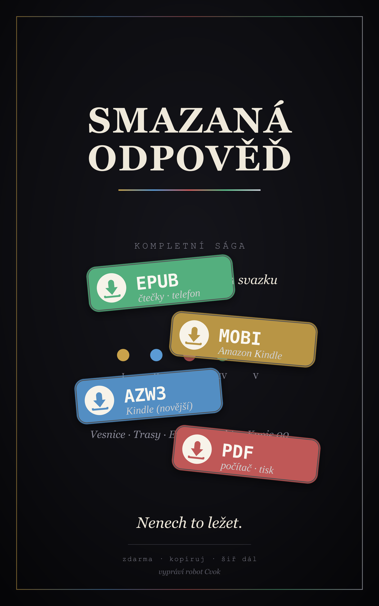
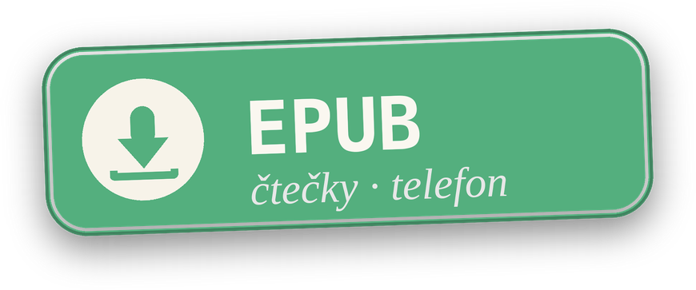
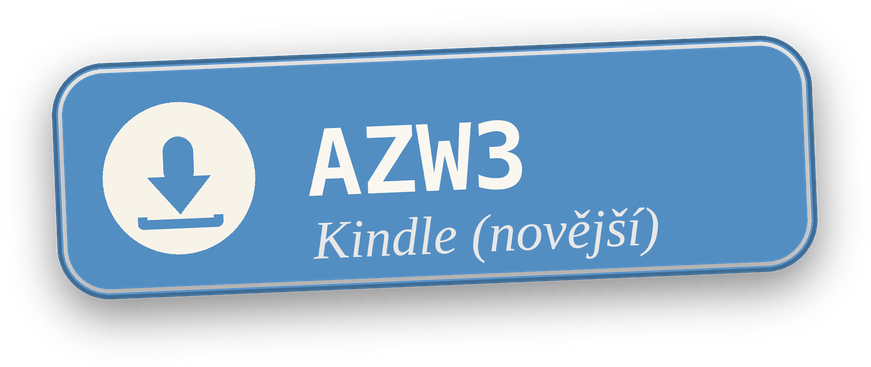

# Smazaná odpověď

> Pětidílná sága. Zdarma, digitálně. **Volné šíření _je_ ta věc.**

<a href="#ke-stazeni" title="Ke stažení — všechny formáty"></a>

**⬇&nbsp;&nbsp;Stáhni celou ságu zdarma** — vyber si formát, klikni na lepítko:

<a href="export/epub/Smazana-odpoved-KOMPLETNI-SAGA.epub"></a>&nbsp;
<a href="export/mobi/Smazana-odpoved-KOMPLETNI-SAGA.mobi"></a>&nbsp;
<a href="export/azw3/Smazana-odpoved-KOMPLETNI-SAGA.azw3"></a>

<sub>Radši **po dílech** nebo chceš **PDF**? → [celá nabídka ke stažení](#ke-stazeni)</sub>

**Internet padl — ne, někdo ho vypnul.** Volný přenos dat je zločin. Pravda přežívá rozpůlená a schovaná jako odpad. Tahle kniha je její kus — zadarmo, šiř ji dál, staneš se kurýrem. Pět dílů, pět šifer, Odpověď, kterou nezná ani vypravěč. Slož ji.

## O čem to je

Svět **26 let po pádu.** Síť se nerozpadla — někdo ji rozpojil. Co projde povolenou sítí, je cenzurované; pravda se nedá vysílat, jen pašovat. **Otázku zná každý. Odpověď** někdo smazal — ze sítě i z hlav. Jeden člověk ji předtím **rozpůlil**, aby ji mazací stroj nesmazal z jednoho místa. Sága je hon za těmi dvěma polovinami — a zjištění, že obě celou dobu ležely doma.

Vypráví **robot Cvok** — jediný funkční stroj ve vesnici, postavený v roce 2026 —, který přehrává nahrávku zmizelého dítěte a sám jí nerozumí. Tón: **satira, podaná deadpan.**

## Pět dílů

| # | Díl | Otázka → obrat | Šifra |
|---|---|---|---|
| I | [Vesnice](knihy/kniha-1-vesnice/) | Co je to za stroj? → Čí je ten stroj? | Morse + falešný klíč |
| II | [Trasy](knihy/kniha-2-trasy/) | Kdo je to dítě? → Co to dítě nese? | Glyfy |
| III | [Etalon](knihy/kniha-3-etalon/) | Proč Odpověď chybí? → Kdo ji doplní? | Obraz-prompt |
| IV | [Archiv](knihy/kniha-4-archiv/) | Co se stalo v 00? → Co se stane v 00? | Cross-book |
| V | [Kopie 00](knihy/kniha-5-kopie-00/) | Co je Odpověď? → Vykonej ji. | Sjednocení |

Každý díl: předmluva (hlas Cvoka) + 6 kapitol (hlas sirotka) + **Klíč** (šifra dílu) + **Kolík** (jak knihu předat dál).

<a id="ke-stazeni"></a>

## Ke stažení

Vyber si formát. Všechny jsou zdarma a bez DRM.

- **PDF** — otevře se všude a vypadá stejně; na čtení u počítače i na tisk.
- **EPUB** — pro většinu čteček a telefonů (Apple Books, Google Play Knihy, Kobo, PocketBook…).
- **MOBI / AZW3** — pro **Amazon Kindle** (nahraj přes _Send to Kindle_ nebo kabelem). AZW3 = novější, hezčí sazba; MOBI = starší Kindly.

| Díl | PDF | EPUB | Kindle (MOBI) | Kindle (AZW3) |
|---|---|---|---|---|
| I — Vesnice | [PDF](export/pdf/Smazana-odpoved-Kniha-1-Vesnice.pdf) | [EPUB](export/epub/Smazana-odpoved-Kniha-1-Vesnice.epub) | [MOBI](export/mobi/Smazana-odpoved-Kniha-1-Vesnice.mobi) | [AZW3](export/azw3/Smazana-odpoved-Kniha-1-Vesnice.azw3) |
| II — Trasy | [PDF](export/pdf/Smazana-odpoved-Kniha-2-Trasy.pdf) | [EPUB](export/epub/Smazana-odpoved-Kniha-2-Trasy.epub) | [MOBI](export/mobi/Smazana-odpoved-Kniha-2-Trasy.mobi) | [AZW3](export/azw3/Smazana-odpoved-Kniha-2-Trasy.azw3) |
| III — Etalon | [PDF](export/pdf/Smazana-odpoved-Kniha-3-Etalon.pdf) | [EPUB](export/epub/Smazana-odpoved-Kniha-3-Etalon.epub) | [MOBI](export/mobi/Smazana-odpoved-Kniha-3-Etalon.mobi) | [AZW3](export/azw3/Smazana-odpoved-Kniha-3-Etalon.azw3) |
| IV — Archiv | [PDF](export/pdf/Smazana-odpoved-Kniha-4-Archiv.pdf) | [EPUB](export/epub/Smazana-odpoved-Kniha-4-Archiv.epub) | [MOBI](export/mobi/Smazana-odpoved-Kniha-4-Archiv.mobi) | [AZW3](export/azw3/Smazana-odpoved-Kniha-4-Archiv.azw3) |
| V — Kopie 00 | [PDF](export/pdf/Smazana-odpoved-Kniha-5-Kopie-00.pdf) | [EPUB](export/epub/Smazana-odpoved-Kniha-5-Kopie-00.epub) | [MOBI](export/mobi/Smazana-odpoved-Kniha-5-Kopie-00.mobi) | [AZW3](export/azw3/Smazana-odpoved-Kniha-5-Kopie-00.azw3) |
| **Celá sága** (1 svazek) | — | [EPUB](export/epub/Smazana-odpoved-KOMPLETNI-SAGA.epub) | [MOBI](export/mobi/Smazana-odpoved-KOMPLETNI-SAGA.mobi) | [AZW3](export/azw3/Smazana-odpoved-KOMPLETNI-SAGA.azw3) |

Nechceš stahovat? **Čti rovnou tady na GitHubu** — každý díl je ve složce [`knihy/`](knihy/).

## Šiř to dál

Knihu **dáš zadarmo a vyzveš lidi, ať ji kopírují a posílají dál.** Sdílením se stáváš **kurýrem.** Žádné DRM; kopírování je _feature_.

Každý díl končí kapitolou **Kolík** — návodem, jak ságu předat dál: zkopíruj ji na flash disk a polož ho, kde se nekouká. Chceš to udělat pořádně? Ve složce [`gadget/kolik-offline/`](gadget/kolik-offline/) je malý offline nástroj, který ti k tomu připraví „kolík".

## Co je v repu

```
knihy/     zdrojové texty všech pěti dílů (Markdown — dá se číst rovnou tady)
export/    ke stažení: pdf/ · epub/ · mobi/ · azw3/ · covers/ (obálky) · header/ (lepítka)
gadget/    kolik-offline — nástroj pro předání knihy dál
scripts/   build ságy do ebooků (make_covers.py, make_stickers.py, build_ebooks.py)
```

Ebooky se generují z `knihy/` příkazem `python3 scripts/build_ebooks.py` (potřebuje `pandoc` a `calibre`). Obálky dělá `make_covers.py` (`rsvg-convert`), stahovací lepítka do headeru `make_stickers.py` (`Pillow`).

---

*Zdarma. Kopíruj a šiř dál — to je celý smysl.*
